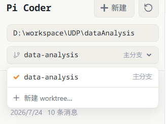
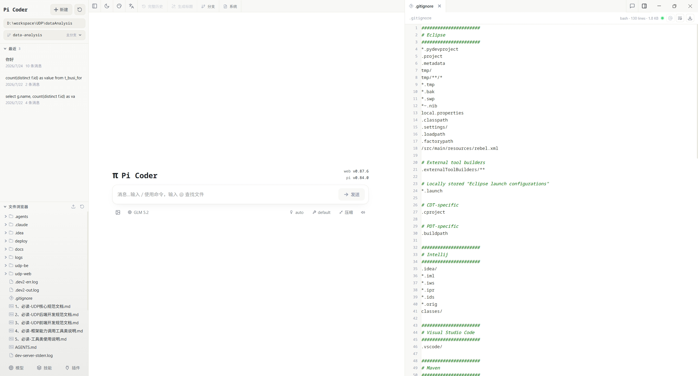
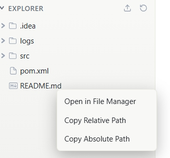
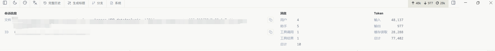
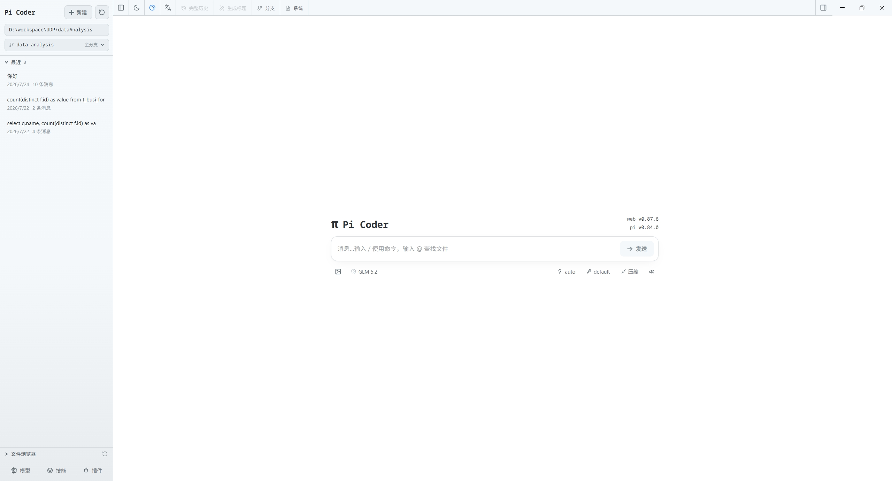
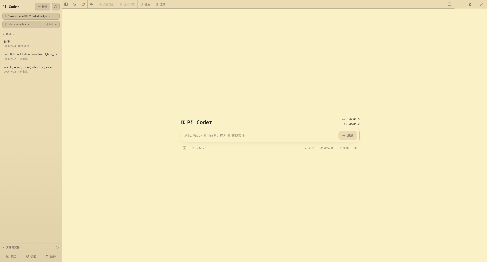
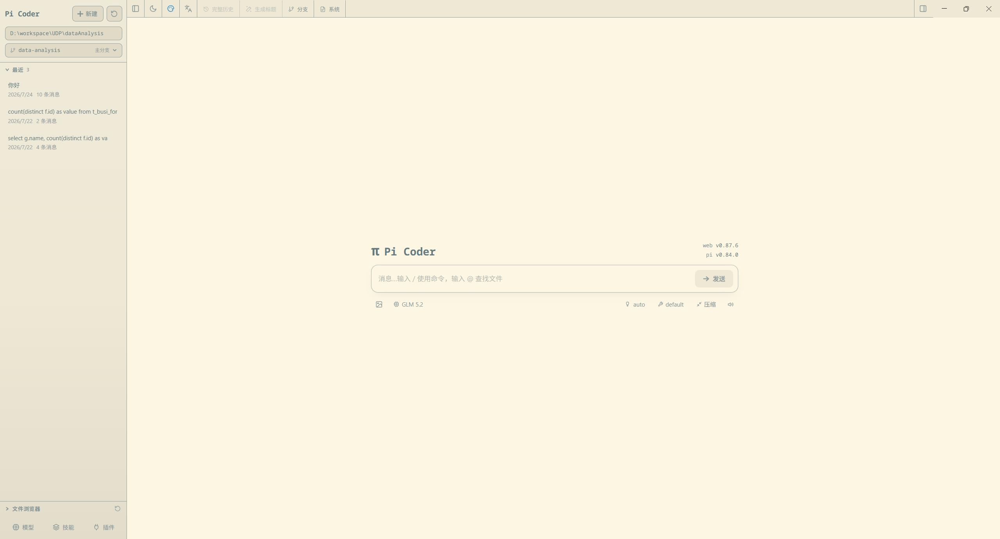

# Pi Coder

[English](./README.md) | [简体中文](./README.zh-CN.md) | [Русский](./README.ru.md)

[pi コーディングエージェント](https://github.com/badlogic/pi-mono) のローカル Web UI をベースに改造したデスクトップアプリです。Pi Coder はローカルの pi セッションファイルを読み込み、セッションの閲覧、リアルタイムチャット、モデル設定、スキル管理、プロジェクトファイルのプレビューを提供します。


CLI と Pi Coder で同じ pi セッションを利用できます。構造化されたツール呼び出し、読みやすい Markdown、セッション閲覧、整理された結果表示を備えています。

## クイックスタート

Pi Coder には Node.js 22.19.0 以降が必要です。現在のバージョンは `node --version` で確認できます。

クイックスタート（アップストリーム Pi Web）：

**インストールせずに実行：**

```bash
npx @agegr/pi-web@latest
```

**またはグローバルにインストール：**

```bash
npm install -g @agegr/pi-web
pi-web
```

続いて [http://127.0.0.1:30141](http://127.0.0.1:30141) を開きます。サーバーの準備が整うと、CLI はブラウザを自動的に開こうとします。Pi Coder はデフォルトで `127.0.0.1` のみをリッスンします。

**オプション：**

```bash
pi-web --port 8080              # カスタムポート
pi-web --hostname 0.0.0.0       # 信頼できるネットワークに公開
pi-web -p 8080 -H 0.0.0.0       # オプションを組み合わせる
pi-web --no-open                # ブラウザを自動的に開かない

PORT=8080 pi-web                # 環境変数にも対応
PI_WEB_HOSTNAME=0.0.0.0 pi-web  # ネットワーク公開を明示的に有効化
PI_WEB_ALLOWED_HOSTS=pi-web.internal pi-web  # プロキシまたはカスタムホスト名を許可
PI_WEB_PASSWORD='十分に長いランダムなパスワード' pi-web  # Basic Auth を有効化（ユーザー名: pi）
PI_WEB_NO_OPEN=1 pi-web         # バックグラウンドサービスとして実行する場合に便利
```

`PI_WEB_PASSWORD` を設定すると、Web インターフェースとすべての API エンドポイントが HTTP Basic Auth で保護されます。ユーザー名は常に `pi` です。未設定または空の場合、認証は無効です。

Pi Coder は高権限のエージェントを呼び出せます。Basic Auth は転送中のパスワードを暗号化しないため、平文 HTTP をインターネットに公開しないでください。リモートアクセスには、信頼できるリバースプロキシによる HTTPS または信頼できる VPN を使用してください。
API リクエストでは、loopback 名、IP リテラル、選択したバインドホスト名、および `PI_WEB_ALLOWED_HOSTS` にカンマ区切りで指定した完全一致のホスト名のみを受け入れます。信頼できるリバースプロキシが異なる外部ホスト名を使用する場合は、この変数を設定してください。

## HTTP プロキシ

Pi Coder は、サーバー側のモデルリクエストと API リクエストに標準の `HTTP_PROXY`、`HTTPS_PROXY`、`NO_PROXY` 環境変数を使用します。

macOS または Linux：

```bash
HTTP_PROXY=http://127.0.0.1:7890 \
HTTPS_PROXY=http://127.0.0.1:7890 \
NO_PROXY=localhost,127.0.0.1 \
npx @agegr/pi-web@latest
```

Windows PowerShell：

```powershell
$env:HTTP_PROXY = "http://127.0.0.1:7890"
$env:HTTPS_PROXY = "http://127.0.0.1:7890"
$env:NO_PROXY = "localhost,127.0.0.1"
npx @agegr/pi-web@latest
```

## デスクトップアプリ

Pi Coder はクロスプラットフォームの Electron デスクトップアプリとしても提供されます。Web UI のすべての機能に加え、ネイティブならではの便利機能を備えています：

- **システムトレイ**：トレイアイコンをクリックしてウィンドウを切り替え。ウィンドウを閉じても Pi Coder はトレイに常駐します。
- **グローバルホットキー** `Ctrl+Shift+P`（macOS は `Cmd+Shift+P`）：どこからでもウィンドウを表示・非表示できます。
- **ログイン時起動**（デフォルトはオフ、アプリメニューで切り替え）。
- **ネイティブ通知**：タスク完了時に通知します。トレイに隠れている場合も届きます。
- **システムテーマに追従**（ライト / ダーク）。
- **シングルインスタンス**：再度起動すると、新しいウィンドウを開くのではなく既存のウィンドウにフォーカスします。
- **アプリ内自動更新**（インストーラ版）。

インストーラは [GitHub Releases](https://github.com/agegr/pi-web/releases) で配布されます。ポータブル版はインストール不要で実行できますが、自動更新は行いません。ビルドとパッケージングの詳細は[デスクトップ版のビルドと配布](./docs/desktop.md)を参照してください。

## 機能

- **作業をすぐに再開**：セッションのパスやターミナル履歴を探さずに、プロジェクトごとに過去の pi の会話を閲覧できます。

- **別の方向性を安全に試す**：以前のメッセージから続けるか、セッションをフォークして別の進め方を試せます。

- **ブランチをまたいで作業**：サイドバーから Git worktree を切り替えると、新しいセッションと Explorer が選択したチェックアウトに追従します。

  

- **プロジェクトを見ながらチャット**：エージェントの作業中に、左側でファイルを閲覧し、右側でソース、ドキュメント、画像、音声、PDF をプレビューできます。

  

- **ファイルブラウザとシステムの連携**



- **セッションの状態を明確に把握**：コンテキスト使用量、コスト、コンパクション状態、システムプロンプトの詳細をトップバーで確認できます。

  

- **ターミナルでの設定を削減**：モデル、ログイン／API キー、モデルテスト、スキルの切り替えを Web UI から管理できます。

- **カスタムテーマ**：Pi ネイティブのカスタムテーマ JSON 設定ファイルに基づいて、独自のインターフェース配色テーマを定義できます。サンプルは `docs/themes` にあります。

  - 使い方：編集した JSON ファイルを `~/.pi/agent/themes/` に配置してください。

  

  

  

## 注意事項

- **データディレクトリ**：Pi Coder はデフォルトで `~/.pi/agent/sessions` を読み込みます。別の pi エージェントディレクトリを指定するには `PI_CODING_AGENT_DIR` を設定してください。
- **セッションファイル**：ファイルは `~/.pi/agent/sessions/<encoded-cwd>/<timestamp>_<uuid>.jsonl` に保存されます。
- **モデル設定**：Models パネルは pi エージェントディレクトリ内の `models.json` を読み書きします。モデルの一覧とデフォルト値は pi の設定から取得されます。
- **ファイルアクセス**：ファイルの閲覧とプレビューは、選択したプロジェクトディレクトリとセッションに含まれる作業ディレクトリに限定されます。
- **Git worktree**：切り替え機能が表示される条件、新しい worktree の作成方法、削除時の動作については、[Pi Coder の Worktree](./docs/worktrees.md) を参照してください。
- **Fork とセッション内ブランチの違い**：Fork は新しい `.jsonl` ファイルを作成します。"Edit from here" は同じセッションファイル内に別のブランチを作成します。

## 開発

```bash
npm install
npm run dev
```

ローカル開発サーバーは [http://127.0.0.1:30141](http://127.0.0.1:30141) で動作します。

よく使うチェック：

```bash
node_modules/.bin/tsc --noEmit
npm run lint
```

ローカル開発中は `next build` / `npm run build` を実行しないでください。`.next/` に書き込みが行われ、開発サーバーに影響する可能性があります。ビルドはリリース作業に任せてください。

## プロジェクト構成

```text
app/
  api/
    agent/          # AgentSession を作成・操作し、SSE イベントを公開
    auth/           # OAuth と API キーの管理
    cwd/validate/   # カスタム作業ディレクトリの検証
    default-cwd/    # pi のデフォルト作業ディレクトリを取得
    files/          # ファイルの一覧、読み込み、プレビュー、監視
    home/           # 現在のユーザーのホームディレクトリ
    models/         # 利用可能なモデル、デフォルトモデル、思考レベル
    models-config/  # models.json の読み書きとモデルのテスト
    sessions/       # セッションの読み込み、名前変更、削除、コンテキスト、HTML エクスポート
    skills/         # スキルの一覧、検索、インストール、有効化／無効化
components/
  AppShell.tsx        # メインレイアウト、URL 状態、上部パネル、ファイルタブ
  SessionSidebar.tsx  # プロジェクト選択、セッションツリー、Explorer
  ChatWindow.tsx      # メッセージ、SSE、画像のドラッグ＆ドロップ、ミニマップ
  ChatInput.tsx       # 入力欄、モデル／ツール／思考／コンパクション／スラッシュコントロール
  MessageView.tsx     # メッセージ、思考、ツール呼び出し／結果の表示
  ModelsConfig.tsx    # モデルと認証の設定パネル
  SkillsConfig.tsx    # スキル管理パネル
  FileExplorer.tsx    # ファイルツリー
  FileViewer.tsx      # ソース、差分、画像、音声、PDF、DOCX のプレビュー
lib/
  http-dispatcher.ts  # サーバー側 fetch の HTTP(S) プロキシ設定
  rpc-manager.ts      # AgentSessionWrapper のライフサイクルとグローバルレジストリ
  session-reader.ts   # .jsonl セッションファイルとブランチコンテキストの解析
  normalize.ts        # toolCall フィールド名の正規化
  file-access.ts      # ファイル読み込みの安全境界
  file-paths.ts       # ファイルパスのエンコードと相対パスのヘルパー
  markdown.ts         # Markdown／Mermaid／KaTeX プラグインの設定
  pi-types.ts         # pi 関連の型
hooks/
  useAgentSession.ts  # セッションの読み込み、コマンド送信、SSE ステートマシン
  useAudio.ts         # 完了通知音
  useDragDrop.ts      # 画像のドラッグ＆ドロップ
  useTheme.ts         # テーマの切り替え
bin/
  pi-web.js           # npm CLI エントリポイント
electron/             # Web UI をネイティブアプリとして同梱するオプションのデスクトップシェル
  main/               # ウィンドウ、トレイ、メニュー、IPC、グローバルショートカット、アップデータ、server サブプロセス
  preload/            # レンダラーに公開する contextBridge API
  icons/              # トレイアイコンと macOS entitlements
instrumentation.ts    # サーバー HTTP ディスパッチャーの初期化
```
